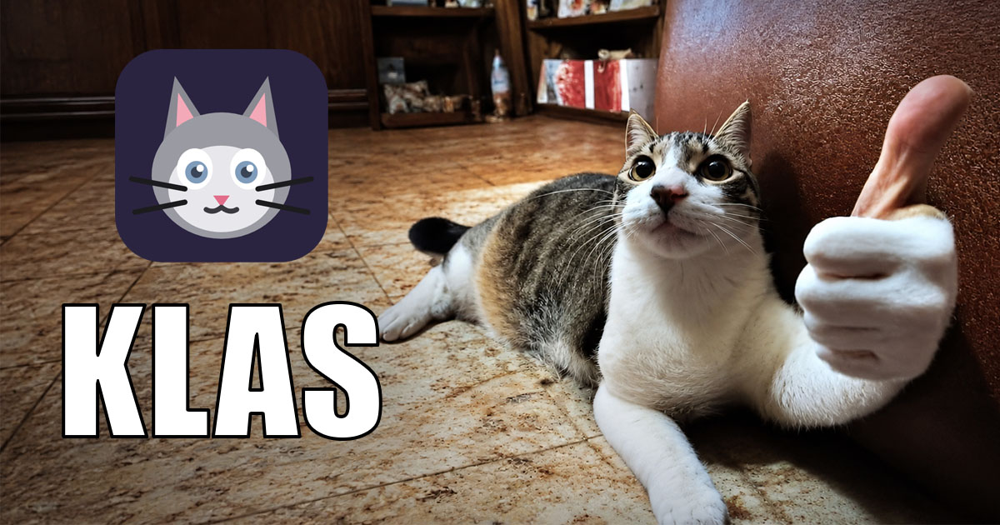

<p align="center">
  
</p>

# KLAS — Krinik Local Agent System

<p align="center">
  <a href="#english"></a>
  &nbsp;
  <a href="#русский"></a>
</p>

[](LICENSE)
[](https://github.com/MikalaiKryvusha/KLAS/releases)
[](https://github.com/MikalaiKryvusha/KAIF)
[](#what-is-inside)
[](#what-is-inside)

---

## English

**English** • [Русский](#русский)

**KLAS is a self-hosted AI ecosystem that lives entirely on your own PC.** A local large language
model runs on your gaming GPU; autonomous agents work in your editor; a web dashboard is the single
control panel; an offline Wikipedia is the knowledge base; and a simple chat serves your family — all
without sending a byte to the cloud. It sleeps until called, runs stably, and gets as close to the
feel of Claude AI as a single graphics card allows.

> 🐈 The cat is KOT KRINIK himself. He approves.

**Universal by design.** One guided wizard takes anyone — even a first-timer — from `git clone` to a
living AI on their machine: it detects your hardware, asks a few questions, downloads everything, sets
up desktop shortcuts, and brings the stack up. One local AI then serves three audiences at once — the
owner (an agent in the editor + a remote API), close ones (a private chat), and knowledge (offline
Wikipedia, searchable from the chat).

### Why

- **Privacy** — your data never leaves the machine; the cloud is optional.
- **Offline** — the LLM, the agents, and the knowledge base all work without the internet.
- **Your own server** — it sleeps until called and doesn't eat resources while idle.
- **Priorities**, in order: **stability → intelligence → speed**. Context-overflow crashes are
  unacceptable on principle.
- **Minimum moving parts** — ideally one engine and one model; borrow proven open-source, don't
  reinvent.

### What is inside

| Component | Implementation | Role |
|-----------|----------------|------|
| Inference engine | [llama.cpp](https://github.com/ggml-org/llama.cpp) (`llama-server`, CUDA) | the LLM on your GPU |
| Model manager | [llama-swap](https://github.com/mostlygeek/llama-swap) — "sleeps until called" | auto load/unload on demand; web UI at `/ui/` |
| Main model | **Qwythos-9B** (Q5_K_M) — **256K context** | the brain (agent-bench 6/6, needle @148K ✅) |
| Alt models | Qwen3.5-35B-A3B (MoE, 98K), Ornith-1.0-35B (SWE-bench 75.6), Qwen3.6-27B (64K), Gemma-4-12B (131K, multimodal) | swapped by name |
| Agent frontend | Zoo Code (VS Code) — local & remote | the agent in your editor |
| Family chat | [Open WebUI](https://github.com/open-webui/open-webui) — personal accounts, private chats | a simple ChatGPT-like chat for close ones |
| Knowledge base | kiwix (offline Wikipedia + more `.zim`) with search from chat & from the agent (MCP) | offline knowledge for people and agents |
| Control panel | homepage + Caddy | one entry point: dashboard, model UI, wiki, remote API |
| Remote access | Caddy + Tailscale Funnel | OpenAI-compatible API + web over the internet |
| Lifecycle | tray controller + desktop shortcuts (Run / Stop / Control Panel) | start/stop the whole stack in one click |

### Install

**The wizard** — multilingual (RU/EN), checks your hardware, foolproof, survives reboots:

```powershell
git clone https://github.com/MikalaiKryvusha/KLAS.git F:\KLAS
node F:\KLAS\tools\install.mjs
```

It picks a language, detects your GPU / driver / Docker / disk, lets you choose models and knowledge
bases from the **live Kiwix catalog** (title, size, article count), downloads everything, creates
desktop shortcuts, and brings the stack up. Stop and re-run anytime — it continues where it left off.
`--yes` installs with recommended defaults, no questions.

**Or the low-level engine** (same downloads, no wizard), and an **anonymous** de-identified copy:

```powershell
node F:\KLAS\tools\deploy.mjs --apply            # deploy by manifest (idempotent)
node F:\KLAS\tools\anonymize.mjs --apply --reinit-git   # a copy with no author/origin
```

Requirements: Windows 11, NVIDIA GPU (16 GB VRAM recommended), Node ≥20, git, winget; Docker optional
(knowledge base + dashboard). Heavy artifacts (engine, models, `.zim`, docker images) are **not** in
the repository — they are pulled at install time.

### Using it

- **Control panel** — `http://localhost/` locally (no password), or `https://<your-machine>.ts.net/`
  over the internet (behind login). Widgets link to the model UI, the wiki, and remote services.
- **Chat for close ones** — Open WebUI, with personal accounts and private chats; the model can search
  the local Wikipedia via a built-in Kiwix tool.
- **Remote API** (Zoo Code / any OpenAI client): Base URL `https://<your-machine>.ts.net/llm/v1`,
  Bearer key from `caddy/PASSWORD.local.txt`, model `qwythos-9b` (or an alt by name).

### Roadmap

| Phase | What | Status |
|-------|------|--------|
| Foundation | KAIF, environment audit, birth of KLAS (name, home, logo) | ✅ |
| Stable stack | inference without context-overflow crashes | ✅ |
| Optimal stack | model research + local benchmarks | ✅ |
| Sleeps until called | llama-swap lifecycle + tray control | ✅ |
| Control panel & knowledge | dashboard, offline wiki, search from chat & agent | ✅ |
| Universal deploy | smart multilingual installer-wizard, turnkey | ✅ |
| Daily driver | everyday use, access for close ones | 🔧 |
| Jarvis | humanlike voice assistant, screen vision, Windows control | 🔲 |

### Managed by KAIF

Development runs as a human-visionary + AI-agent tandem on the
**[KAIF](https://github.com/MikalaiKryvusha/KAIF)** framework. **KLAS ≠ KAIF:** KAIF is an auxiliary
dev framework deployed locally to help build KLAS — for KLAS it is a 3rd-party tool and is **not**
vendored into this repository.

---

## Русский

**Русский** • [English](#english)

**KLAS — self-hosted экосистема агентского ИИ, целиком живущая на вашем личном ПК.** Локальная
LLM работает на геймерской видеокарте; автономные агенты — в редакторе; веб-дашборд — единый пульт;
оффлайн-Википедия — база знаний; а простой чат служит родным — и всё это без единого байта в облако.
Система «спит», пока не позвали, работает стабильно и максимально приближается к ощущению Claude AI в
пределах одной видеокарты.

> 🐈 Кот — это Кот Криник собственной персоной. Одобряет.

**Универсальность в основе.** Один мастер проводит любого — даже новичка — от `git clone` до живого
ИИ на его машине: определяет железо, задаёт пару вопросов, всё скачивает, создаёт ярлыки на Рабочем
столе и поднимает стек. Один локальный ИИ обслуживает сразу троих: владельца (агент в редакторе +
удалённый API), близких (приватный чат) и знания (оффлайн-Википедия с поиском прямо из чата).

### Зачем

- **Приватность** — данные не покидают машину; облако не обязательно.
- **Оффлайн** — LLM, агенты и база знаний работают без интернета.
- **Свой сервер** — «спит», пока не позвали, не ест ресурсы в простое.
- **Приоритеты** по порядку: **стабильность → ум → скорость**. Ошибки переполнения контекста
  недопустимы в принципе.
- **Минимум сущностей** — в идеале один движок и одна модель; берём проверенный open-source, а не
  изобретаем заново.

### Что внутри

| Компонент | Реализация | Роль |
|-----------|------------|------|
| Движок инференса | [llama.cpp](https://github.com/ggml-org/llama.cpp) (`llama-server`, CUDA) | LLM на вашей GPU |
| Менеджер моделей | [llama-swap](https://github.com/mostlygeek/llama-swap) — «спит, пока не позовут» | автозагрузка/выгрузка по запросу; веб-UI на `/ui/` |
| Основная модель | **Qwythos-9B** (Q5_K_M) — **256K контекста** | «мозг» (agent-bench 6/6, needle @148K ✅) |
| Запасные модели | Qwen3.5-35B-A3B (MoE, 98K), Ornith-1.0-35B (SWE-bench 75.6), Qwen3.6-27B (64K), Gemma-4-12B (131K, мультимодальная) | свопятся по имени |
| Агентский фронтенд | Zoo Code (VS Code) — локально и удалённо | агент в редакторе |
| Чат для родных | [Open WebUI](https://github.com/open-webui/open-webui) — личные аккаунты, приватные чаты | простой ChatGPT-подобный чат близким |
| База знаний | kiwix (оффлайн-Википедия и другие `.zim`) с поиском из чата и от агента (MCP) | оффлайн-знания людям и агентам |
| Пульт управления | homepage + Caddy | единый вход: дашборд, UI моделей, вики, удалённый API |
| Удалённый доступ | Caddy + Tailscale Funnel | OpenAI-совместимый API + веб через интернет |
| Жизненный цикл | трей-контроллер + ярлыки (Run / Stop / Control Panel) | запуск/остановка всего стека в один клик |

### Установка

**Мастер** — мультиязычный (рус/eng), проверяет железо, с защитой от дурака, переживает перезагрузки:

```powershell
git clone https://github.com/MikalaiKryvusha/KLAS.git F:\KLAS
node F:\KLAS\tools\install.mjs
```

Он выбирает язык, определяет GPU / драйвер / Docker / диск, даёт выбрать модели и базы знаний из
**живого каталога Kiwix** (название, размер, число статей), всё скачивает, создаёт ярлыки на Рабочем
столе и поднимает стек. Можно прервать и запустить снова — продолжит с места остановки. Флаг `--yes`
ставит с рекомендуемыми настройками, без вопросов.

**Или низкоуровневый движок** (те же скачивания, без мастера) и **анонимная** обезличенная копия:

```powershell
node F:\KLAS\tools\deploy.mjs --apply            # развёртывание по манифесту (идемпотентно)
node F:\KLAS\tools\anonymize.mjs --apply --reinit-git   # копия без автора/origin
```

Требования: Windows 11, NVIDIA GPU (16 ГБ VRAM рекоменд.), Node ≥20, git, winget; Docker —
опционально (база знаний + дашборд). Тяжёлое (движок, модели, `.zim`, docker-образы) в репозиторий
**не** входит — докачивается при установке.

### Как пользоваться

- **Пульт управления** — `http://localhost/` локально (без пароля) или
  `https://<ваша-машина>.ts.net/` через интернет (под логином). Виджеты ведут на UI моделей, вики и
  удалённые сервисы.
- **Чат для родных** — Open WebUI: личные аккаунты и приватные чаты; модель умеет искать по локальной
  Википедии встроенным инструментом Kiwix.
- **Удалённый API** (Zoo Code / любой OpenAI-клиент): Base URL `https://<ваша-машина>.ts.net/llm/v1`,
  Bearer-ключ из `caddy/PASSWORD.local.txt`, модель `qwythos-9b` (или запасная по имени).

### Дорожная карта

| Фаза | Что | Статус |
|------|-----|--------|
| Фундамент | KAIF, аудит окружения, рождение KLAS (имя, дом, логотип) | ✅ |
| Стабильный стек | инференс без падений от переполнения контекста | ✅ |
| Оптимальный стек | исследование моделей + локальные бенчи | ✅ |
| «Спит, пока не позовут» | жизненный цикл llama-swap + трей-управление | ✅ |
| Пульт и знания | дашборд, оффлайн-вики, поиск из чата и от агента | ✅ |
| Универсальное развёртывание | умный мультиязычный мастер-установщик под ключ | ✅ |
| Ежедневная работа | повседневное использование, доступ близким | 🔧 |
| Jarvis | человекоподобный голосовой ассистент, зрение экрана, управление Windows | 🔲 |

### Управляется через KAIF

Разработкой рулит тандем «человек-визионер + ИИ-агент» на фреймворке
**[KAIF](https://github.com/MikalaiKryvusha/KAIF)**. **KLAS ≠ KAIF:** KAIF — вспомогательный
dev-фреймворк, развёрнутый локально в помощь разработке KLAS; для KLAS он 3rd-party-инструмент и в
этот репозиторий **не** упаковывается.

---

## Author · Автор

© 2026 **Mikalai Kryvusha** aka **KOT KRINIK** · Николай Кривуша aka Кот Криник

License · Лицензия — [MIT](LICENSE).
