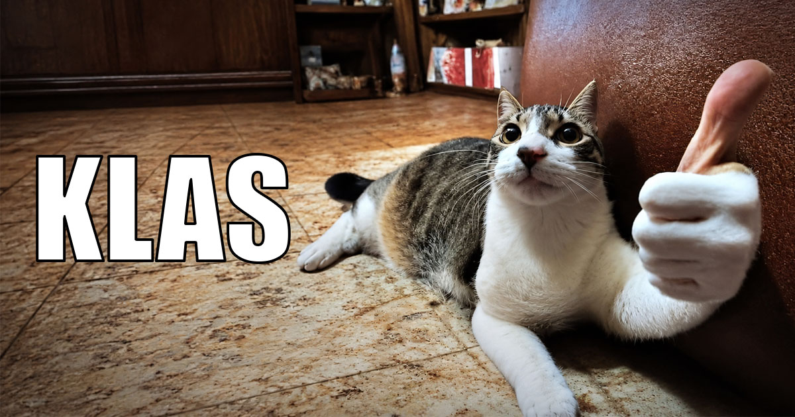

# KLAS — Krinik Local Agent System




**KLAS** — self-hosted экосистема агентского ИИ на личном ПК: локальная LLM на геймерской GPU,
автономные агенты, веб-дашборд управления и оффлайн-база знаний (локальная википедия). Полная
приватность данных, оффлайн-эффективность и опыт, максимально близкий к Claude AI — в пределах
RTX 5070 Ti 16 GB. Служит владельцу и его близким.

> 🐈 На логотипе — Кот Криник собственной персоной. Одобряет.

---

## Зачем

- **Приватность** — данные не покидают машину; облако не обязательно.
- **Оффлайн** — LLM, агенты и база знаний работают без интернета.
- **Свой сервер** — система «спит», пока не позвали, и не ест ресурсы ПК в простое.
- **Приоритеты** (в этом порядке): **стабильность → ум → скорость**. Ошибки переполнения
  контекста недопустимы в принципе.

---

## Что внутри

| Компонент | Реализация сейчас | Роль |
|-----------|-------------------|------|
| Движок LLM | [llama.cpp](https://github.com/ggml-org/llama.cpp) (CUDA-сборка, `llama-server`) | инференс на GPU |
| Модель | gemma-4-12b Q4_K_XL (GGUF) | «мозг» системы |
| Агентский фронтенд | Zoo Code (VS Code) | агент в редакторе |
| База знаний | kiwix (локальная википедия, docker) | оффлайн-знания для людей и агентов |
| Дашборд | homepage (docker) → «пульт управления» (Фаза 5) | управление сервисами |
| Внешний доступ | Tailscale Funnel | доступ близким (Фаза 6) |

Стек текущий, не окончательный: Фаза 2 — исследование оптимальной связки «движок + модель +
фронтенд» на лето 2026. Технологии проекта — JS (современный `.mjs` + Node) для скриптов,
инструментов, бекенда и БД.

---

## Дом системы

```
F:\KLAS\
├── (документы проекта, tools\, plans\, bugs\, …)   ← управляющий центр (этот репозиторий)
├── llamacpp\                                       ← движок + профили запуска (bat\)
├── LLMs\                                           ← GGUF-модели (в git не попадают)
├── homepage\ caddy\ kiwixdb\ + docker-compose.yml  ← docker-сервисы
├── mcp\                                            ← MCP-серверы (веб-поиск)
└── nssm\ + tailscale_funnel_443.bat                ← сервис-менеджер и внешний доступ
```

Репозиторий — только документы, конфиги и скрипты; модели и данные сервисов живут рядом,
вне git. Полная карта — `PROJECT_STRUCTURE_EXTERNAL_MAP.md`.

---

## Дорожная карта

| Фаза | Что | Статус |
|------|-----|--------|
| 0 | Фундамент: KAIF, аудит окружения, git | ✅ |
| 0.5 | Рождение KLAS: имя, дом `F:\KLAS\`, репозиторий, логотип | ✅ |
| 1 | Стабилизация текущего стека (баг переполнения контекста) | 🔧 |
| 2 | Исследование оптимального стека (лето 2026, ≤16 GB VRAM) | 🔲 |
| 3 | Развёртывание целевого стека + бенчмарки | 🔲 |
| 4 | Жизненный цикл «спит, пока не позовут» | 🔲 |
| 5 | Веб-дашборд «пульт управления» + база знаний | 🔲 |
| 6 | Стабильная ежедневная работа, доступ близким | 🔲 |

Подробности — `MASTER_PLAN.md`; живое состояние — `STATUS.md`.

---

## Как управляется

Проектом рулит связка «человек-визионер + ИИ-агент» на фреймворке
**[KAIF](https://github.com/MikalaiKryvusha/KAIF)** (Krinik AI Framework): внешняя память агента
в документах репозитория, дисциплина автономии, скиллы-ритуалы (`/resume`, `/pause`, `/autoloop`,
`/report-bug`, `/interview`, …). Канон для агента — `AGENT_GUIDE.md`, видение владельца — `GOAL.md`.

---

## Автор

© 2026 **Mikalai Kryvusha** aka **KOT KRINIK** · Николай Кривуша aka Кот Криник

Лицензия — [MIT](LICENSE).
