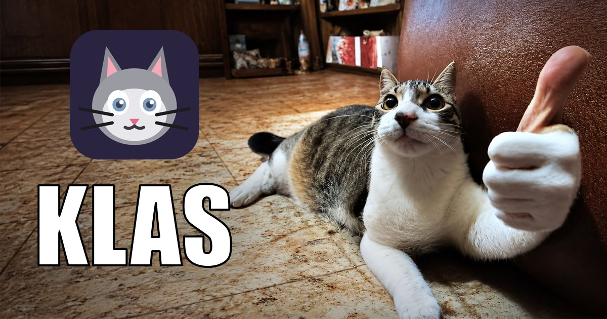

<p align="center">
  
</p>

# KLAS — Krinik Local Agent System

[](LICENSE)
[](https://github.com/MikalaiKryvusha/KLAS/releases)
[](https://github.com/MikalaiKryvusha/KAIF)


---

<a name="русский"></a>

## Русский

[Read in English →](#english)

**KLAS** — self-hosted экосистема агентского ИИ, целиком живущая на личном компьютере.
Локальная большая языковая модель работает на игровой видеокарте; автономные агенты — в редакторе
кода; веб-пульт — единая точка управления; оффлайн-Википедия — база знаний; простой чат служит
близким. Данные не покидают компьютер.

Один локальный ИИ обслуживает три назначения:

- **владельца** — агент в редакторе кода и удалённый API;
- **близких** — приватный чат в окне браузера;
- **знания** — оффлайн-Википедия с поиском из чата и от агента.

> 🐈 Кот на логотипе — Кот Криник собственной персоной. Одобряет.

Настоящий документ является руководством пользователя.

---

## 1. Назначение

### 1.1. Основные положения

1. KLAS является self-hosted экосистемой агентского ИИ и размещается целиком на личном компьютере
   пользователя. Обращения к облачным сервисам ИИ не выполняются; данные пользователя не покидают
   компьютер.
2. Основой системы является локальная большая языковая модель, работающая на видеокарте
   пользователя. Модель загружается по первому обращению и выгружается после 300 секунд простоя —
   система «спит, пока не позовут» и в простое ресурсы компьютера не расходует.
3. Приоритеты системы, в порядке убывания: стабильность, ум, скорость. Ошибки переполнения
   контекста считаются недопустимыми.
4. Число сущностей поддерживается минимальным: один движок инференса и одна основная модель.
   Применяется проверенный открытый код; собственные решения пишутся только там, где готовых нет.

### 1.2. Границы применения

1. Система работает на одном компьютере под управлением Windows 11. Серверное оборудование не
   требуется.
2. Облачные и платные подписки не используются: все компоненты системы бесплатны и открыты.
3. После установки языковые модели, агенты, голосовой тракт и база знаний работают без интернета.
   Интернет требуется при установке — для скачивания компонентов — и для удалённого доступа.

---

## 2. Состав системы

### 2.1. Основные положения

1. Состав системы приведён в Таблице 1. Тяжёлые компоненты — движок, модели, базы знаний,
   docker-образы — в репозиторий не входят и скачиваются при установке по правилам раздела 3.
2. Веб-часть системы (пульт, чат, вики, вход) работает в контейнерах Docker. LLM-часть (движок,
   менеджер моделей) и голосовой тракт работают непосредственно в Windows.

Таблица 1 — Состав системы

| Компонент | Реализация | Назначение |
|---|---|---|
| Движок инференса | [llama.cpp](https://github.com/ggml-org/llama.cpp) — `llama-server`, CUDA, сборка `b10167` | выполнение языковой модели на видеокарте |
| Менеджер моделей | [llama-swap](https://github.com/mostlygeek/llama-swap) — порт `8080` | загрузка модели по обращению и выгрузка после 300 с простоя; веб-пульт моделей на `/ui/` |
| Ядро ассистента | [OpenClaw](https://github.com/openclaw/openclaw) на локальных моделях | агентный цикл ассистента: навыки, вызовы инструментов, сессии |
| Голосовой тракт | [Silero](https://github.com/snakers4/silero-models) TTS + [GigaAM-v3](https://github.com/salute-developers/GigaAM) STT | KLAS говорит и слышит; процессор, офлайн (раздел 9) |
| Чат для близких | [Open WebUI](https://github.com/open-webui/open-webui) — порт `3080` | личные аккаунты и приватные чаты (раздел 6) |
| База знаний | [kiwix](https://kiwix.org/) — путь `/wiki/` | оффлайн-Википедия и другие базы `.zim` (раздел 7) |
| Пульт управления | [homepage](https://github.com/gethomepage/homepage) | единая стартовая страница системы (раздел 5) |
| Вход и доступ | [Caddy](https://caddyserver.com/) + [Tailscale Funnel](https://tailscale.com/kb/1223/funnel) | локальный вход без пароля, удалённый — под защитой (раздел 8) |
| Жизненный цикл | трей-контроллер + ярлыки Run / Stop / Control Panel | запуск и остановка всего стека (раздел 4) |
| Агентский фронтенд | Zoo Code (VS Code) — локально и удалённо | агент в редакторе кода |

### 2.2. Модели

1. Перечень моделей приведён в Таблице 2. Модель выбирается по имени в поле `model` запроса;
   менеджер моделей загружает её автоматически и выгружает после 300 секунд простоя.
2. Основной моделью является `qwen3.6-35b-a3b` — выбрана за ум при достаточной скорости. Остальные
   модели являются запасными и специализированными.
3. Настройки каждой модели — контекст, сэмплинг, кванты — зафиксированы в
   `llama-swap/config.yaml`. У основной модели существует алиас `qwen3.6-35b-a3b-r` (повторный
   вызов того же экземпляра), у `gemma-4-12b` — профиль `gemma-4-12b-norep` без штрафов за повтор.

Таблица 2 — Модели

| Имя модели (API) | Модель и квант | Контекст, токенов | Роль |
|---|---|---|---|
| `qwen3.6-35b-a3b` | Qwen3.6-35B-A3B, UD-IQ3_S | 98 304 | **основная** |
| `qwythos-9b` | Qwythos-9B, Q5_K_M | 262 144 | очень длинные документы |
| `qwen3.5-35b` | Qwen3.5-35B-A3B, UD-IQ3_S | 98 304 | запасная (прежняя основная) |
| `qwen3.6-27b` | Qwen3.6-27B, UD-IQ3_XXS | 65 536 | плотная запасная |
| `ornith-35b` | Ornith-1.0-35B, IQ3_XXS | 49 152 | быстрая генерация коротких задач |
| `gemma-4-12b` | Gemma-4-12B, UD-Q4_K_XL | 131 072 | мультимодальная (зрение) |

---

## 3. Установка

### 3.1. Основные положения

1. Система устанавливается мастером установки (раздел 3.2). Низкоуровневый движок развёртывания
   доступен отдельными командами (раздел 3.4).
2. Требования: Windows 11 x64; видеокарта NVIDIA — рекомендуется 16 ГБ видеопамяти (без видеокарты
   модель работает на процессоре — медленно); Node.js версии 20 или выше; git; winget (для
   установки менеджера моделей). Docker не обязателен: без него пропускается веб-часть — пульт,
   чат и вики.
3. Репозиторий клонируется в каталог `F:\KLAS`. Пути ярлыков, трея и автозапуска привязаны к
   данному каталогу; установка в другой каталог в текущей версии не поддерживается (раздел 10).
4. Свободного места на диске требуется на смету скачивания и 5 ГБ запаса. При нехватке места
   установка останавливается до начала скачивания.

### 3.2. Мастер установки

```powershell
git clone https://github.com/MikalaiKryvusha/KLAS.git F:\KLAS
node F:\KLAS\tools\install.mjs
```

1. Мастер двуязычен: язык (русский или английский) выбирается первым вопросом либо задаётся флагом
   `--lang ru|en`.
2. Мастер определяет окружение только чтением — видеокарта, драйвер, Docker, WSL2, Node, git,
   winget, свободное место, интернет — и печатает результат таблицей.
3. Если видеокарта есть, а драйвер не обнаружен, то мастер открывает страницу загрузки драйвера и
   с согласия пользователя ставит одноразовое продолжение установки после перезагрузки.
4. Вопросы мастера: выбор модели — Qwythos-9B (~6 ГБ, рекомендуется) и/или Gemma-4-12B (~7 ГБ);
   выбор баз знаний из живого каталога Kiwix с названием, размером и числом статей. Во всех
   вопросах Enter выбирает рекомендуемый вариант.
5. Основная модель `qwen3.6-35b-a3b` (~13.7 ГБ) мастером не предлагается; она устанавливается
   полным развёртыванием по правилам раздела 3.4.
6. До начала скачивания мастер называет смету («Будет скачано ~N ГБ») и требует подтверждения.
7. Установку допускается прервать и запустить заново: мастер продолжает с места остановки
   (прогресс хранится в файле `.deploy-state.json`; флаг `--reset` начинает установку заново).
8. В конце мастер создаёт ярлыки на Рабочем столе (раздел 4), с согласия пользователя ставит
   автозапуск, поднимает стек и показывает адреса: пульт `http://localhost/`, чат
   `http://localhost:3080/`, вики `http://localhost/wiki/`. Логин и пароль размещаются в файле
   `caddy/PASSWORD.local.txt`.
9. Флаг `--yes` выполняет установку без вопросов с рекомендуемыми настройками: одна модель, без
   баз знаний, без автозапуска.

### 3.3. Что скачивается

Таблица 3 — Скачиваемые компоненты

| Компонент | Источник | Объём |
|---|---|---|
| движок llama.cpp сборки `b10167` (CUDA, Windows x64) | релиз GitHub | ~0.5 ГБ |
| модели GGUF из манифеста (четыре из Таблицы 2) | HuggingFace | 6.5…13.7 ГБ каждая, все вместе ~41 ГБ |
| менеджер моделей llama-swap | winget | — |
| базы знаний `.zim` | каталог Kiwix | по выбору пользователя |
| голосовые модели: Silero (145 + 57 МБ), GigaAM-v3 (225 МБ) | models.silero.ai, HuggingFace | ~0.5 ГБ с окружением |
| docker-образы веб-части | ghcr.io и Docker Hub | — |

### 3.4. Движок развёртывания

```powershell
node F:\KLAS\tools\deploy.mjs            # план (dry-run): печатает, чего не хватает; ничего не меняет
node F:\KLAS\tools\deploy.mjs --apply    # развёртывание по манифесту, включая все модели
```

1. Развёртывание идемпотентно: каждый компонент проверяется по файлу и точному размеру; что уже на
   месте — пропускается.
2. Скачивание выполняется с докачкой после обрыва и атомарной заменой; где задана контрольная
   сумма, она проверяется.
3. Флаг `--items a,b,c` ограничивает развёртывание перечисленными элементами манифеста
   `tools/deploy.manifest.json`. Мастер установки пользуется этим же движком.
4. Полное развёртывание без `--items` устанавливает четыре модели манифеста — основную
   `qwen3.6-35b-a3b`, `qwen3.5-35b`, `qwythos-9b`, `gemma-4-12b` — а также голосовой тракт и ядро
   ассистента. Модели `qwen3.6-27b` и `ornith-35b` в манифест не входят и добавляются отдельно.

### 3.5. Анонимная копия

```powershell
node F:\KLAS\tools\anonymize.mjs                        # репетиция: показывает, что изменится
node F:\KLAS\tools\anonymize.mjs --apply --reinit-git   # обезличить копию и стереть историю git
```

1. Анонимизация заменяет имена, ссылки и адреса автора нейтральными, обезличивает конфигурацию,
   отвязывает копию от исходного репозитория и в конце выполняет самопроверку на утечки.
2. Анонимизация выполняется только на свежем клоне, не на рабочем репозитории.
3. Самопроверка обходит всё дерево копии, а не только те файлы, которые умеет править замена, и
   завершается с ошибкой, если имя автора где-то осталось. Файл `README.pdf` — зеркало `README.md`:
   старое снимается и собирается заново из обезличенного текста. Не хватило зависимостей или
   браузера — копия остаётся без него, и скрипт говорит это вслух.
4. Единственное осознанное исключение — `LICENSE`: уведомление об авторском праве остаётся на
   месте, этого требуют условия MIT. Скрипт называет этот файл вслух, а не пропускает молча.
5. Проверить саму анонимизацию можно, ничем не рискуя: `node tools/anonymize.mjs --selftest`
   выполняет её на одноразовом клоне и отдельно убеждается, что сломанная версия завершается
   ошибкой.

---

## 4. Запуск и остановка

### 4.1. Основные положения

1. Запуск и остановка выполняются ярлыками Рабочего стола, треем либо командой PowerShell. Все три
   способа вызывают один и тот же сценарий `tools/klas.ps1`.
2. Запуск поднимает: контейнеры веб-части (пульт, чат, вики, вход), менеджер моделей, удалённый
   доступ (Tailscale Funnel) и гейтвей ядра ассистента.
3. Остановка первым действием закрывает весь внешний доступ (`tailscale funnel reset`), затем
   гасит контейнеры, менеджер моделей и гейтвей.
4. Сама языковая модель отдельного запуска не требует: она загружается по первому обращению и
   выгружается после 300 секунд простоя.

### 4.2. Способы управления

Таблица 4 — Управление стеком

| Способ | Действие |
|---|---|
| ярлык **Run KLAS** | тихо поднять весь стек, без окон консоли |
| ярлык **Stop KLAS** | тихо погасить весь стек |
| ярлык **KLAS Control Panel** | открыть пульт `http://localhost/` |
| трей-иконка «Кот Криник» | меню: открыть пульт · остановить и выйти; двойной щелчок открывает пульт |
| `powershell -File F:\KLAS\tools\klas.ps1 -Action up` / `-Action down` | то же из командной строки |

1. При запуске трей сообщает результат уведомлением. Частичный подъём — например, без Docker —
   называется прямо: «поднят ЧАСТИЧНО».
2. Автозапуск при входе в Windows ставится только с согласия пользователя:
   `powershell -File F:\KLAS\tools\install-autostart.ps1`; удаление —
   `Unregister-ScheduledTask -TaskName "KLAS" -Confirm:$false`.

### 4.3. Проверка здоровья

```powershell
npm run health        # либо: powershell -File F:\KLAS\tools\health-check.ps1
```

Проверяются: слушатель порта 8080, процессы движка и их память, ответы API (`/health`, `/props`,
`/v1/models`), видеопамять и температура видеокарты. Команда только читает; код завершения 0 —
здоров, 1 — есть проблемы.

---

## 5. Пульт управления

1. Пульт открывается на `http://localhost/` — локально, без пароля — и на
   `https://<ваша-машина>.ts.net/` — через интернет, под логином.
2. Пульт содержит группы ссылок: чат для близких, пульт моделей (`/ui/` — загрузка и выгрузка
   моделей, логи, метрики), база знаний (`/wiki/`), удалённый LLM-API. Ссылки относительные и
   работают одинаково локально и через интернет; ссылка удалённого LLM-API — абсолютная, на
   funnel-хост.
3. На пульте отображаются виджеты состояния: процессор, память, аптайм, доступность сервисов.
4. Пульт устанавливается как веб-приложение (PWA): браузер предлагает «Установить приложение»,
   иконка — Кот Криник.

---

## 6. Чат для близких

### 6.1. Основные положения

1. Чат для близких — Open WebUI: простой интерфейс наподобие ChatGPT, работающий на локальной
   модели.
2. Адрес локально — `http://localhost:3080/`; через интернет — `https://<ваша-машина>.ts.net:8443/`.
   Ссылка «Чат» на пульте ведёт на нужный адрес автоматически.
3. У каждого пользователя личный аккаунт и приватные чаты. Регистрация открыта: новый пользователь
   заводит аккаунт сам и работает сразу.
4. Всем пользователям доступны все модели Таблицы 2 по имени.

### 6.2. Поиск по базе знаний из чата

1. Модель в чате умеет искать по локальной Википедии инструментом `kiwix_search` и отвечать с
   указанием статьи-источника.
2. Инструмент подключается один раз вручную: Open WebUI → Workspace → Tools → Import Tools → файл
   `open-webui/tools/kiwix_search.tool.json`. После импорта инструмент включается в чате либо
   привязывается к модели.
3. Для работы инструмента требуется модель с поддержкой вызова инструментов; модели Qwen из
   Таблицы 2 подходят.
4. Новые базы `.zim` подхватываются инструментом и вики без настройки — после перезапуска
   kiwix (раздел 7).

---

## 7. База знаний

1. База знаний — kiwix-serve с базами `.zim` (Википедия и прочие) в каталоге `kiwixdb/`.
2. Вики открывается на `http://localhost/wiki/` — локально без пароля, через интернет под логином.
3. Базы выбираются при установке из живого каталога Kiwix. Пополнение позже:

```powershell
node tools/deploy-knowledge.mjs --list          # рекомендованные базы
node tools/deploy-knowledge.mjs --get <ключ>    # скачать базу в kiwixdb/
docker restart kiwix_wikipedia                  # подхватить новую базу
```

4. Для агента в редакторе поиск по базам выполняется через MCP-сервер openzim-mcp; подключение
   выполняется вручную по инструкции `homeworks/02_knowledge_base_mcp.md`
   (подготовка адаптера — `node tools/deploy-knowledge.mjs --mcp`).

---

## 8. Удалённый доступ и API

### 8.1. Основные положения

1. Удалённый доступ предоставляется через Tailscale Funnel; проброс портов на роутере и белый
   IP-адрес не требуются. Локальные порты входа слушают только `127.0.0.1` — в локальную сеть
   веб-вход Caddy не публикуется.
2. Точки входа и их защита приведены в Таблице 5.

Таблица 5 — Точки входа

| Адрес | Что открывается | Защита |
|---|---|---|
| `http://localhost/` | пульт, `/ui/`, `/wiki/` | без пароля (только этот компьютер) |
| `http://localhost:3080/` | чат | логин Open WebUI |
| `http://127.0.0.1:8080/v1` | LLM API локально | без ключа |
| `https://<ваша-машина>.ts.net/` | пульт, `/ui/`, `/wiki/` | логин и пароль |
| `https://<ваша-машина>.ts.net/llm/v1` | LLM API через интернет | Bearer-ключ |
| `https://<ваша-машина>.ts.net:8443/` | чат через интернет | логин Open WebUI |

3. Логин, пароль и Bearer-ключ размещаются в файле `caddy/PASSWORD.local.txt`. Секреты в
   репозиторий не попадают: в git хранятся только шаблоны (`caddy/Caddyfile.example`, `LINKS.md`).

### 8.2. Подключение OpenAI-клиента

1. Любой OpenAI-совместимый клиент — Zoo Code и прочие — подключается так: Base URL
   `https://<ваша-машина>.ts.net/llm/v1`, API Key — Bearer-ключ из `caddy/PASSWORD.local.txt`,
   модель `qwen3.6-35b-a3b` либо другая из Таблицы 2.
2. Проверка с любого устройства:

```bash
curl -H "Authorization: Bearer <КЛЮЧ>" https://<ваша-машина>.ts.net/llm/v1/models
```

3. Смена ключа: новый ключ вписывается в `caddy/Caddyfile` и `caddy/PASSWORD.local.txt`, затем
   выполняется `docker restart caddy`. Полное закрытие удалённого доступа — `tailscale funnel
   reset`; оно же выполняется ярлыком Stop KLAS.

---

## 9. Голосовой ассистент

### 9.1. Что работает

1. KLAS говорит и слышит полностью офлайн и на процессоре — видеопамять остаётся языковой модели.
   Синтез — Silero (резидентный демон: модель загружается один раз, синтез фразы ~0.1 с);
   распознавание — GigaAM-v3 через sherpa-onnx.
2. Полный голосовой диалог работает по нажатию (push-to-talk): Enter — начать запись, Enter —
   закончить; микрофон → распознавание → ядро ассистента → синтез → динамики. Ответ произносится
   по предложениям, не дожидаясь конца генерации.
3. В прогретой сессии ход «вопрос → начало ответа» занимает ~8 секунд. Первый ход новой сессии
   занимает до ~50 секунд: ядро предзаполняет длинный системный промпт (раздел 10).
4. Текст перед синтезом нормализуется: числа, дроби и единицы измерения читаются словами;
   аббревиатура, складывающаяся в слово, читается словом («KLAS» произносится «класс»), не
   складывающаяся — по буквам; английские слова произносятся транслитерацией кириллицей, чтобы всю
   реплику вёл один диктор. Транслитерация — временное решение до ввода мультиязычного движка
   синтеза.

### 9.2. Команды

```powershell
powershell -File F:\KLAS\tools\klas.ps1 -Action up    # поднять стек (нужен для диалога и бенча)
node tools/voice-talk.mjs                             # живой диалог с микрофона (push-to-talk)
node tools/voice-say.mjs "Привет" --play              # синтез фразы
node tools/voice-hear.mjs файл.wav                    # распознавание файла
node tools/voice-roundtrip.mjs                        # самопроверка тракта (критерий ≥90%)
node tools/voice-bench.mjs --quick                    # бенч голосового тракта
```

5. KLAS узнаёт своё имя. Обучены два детектора активации — «Джарвис» и «Джой», по 13.8 КБ каждый.
   На проверке живым микрофоном они срабатывают на голос владельца и не срабатывают друг на друга.
   Детектор слушает круглосуточно и стоит около половины процента одного процессорного ядра из
   шестнадцати; видеопамять не занимает вовсе. Готовые детекторы для этого не годились: проверка
   показала 3 из 6 и 0 из 10 срабатываний на русском произношении, поэтому модели обучены свои.

```powershell
voice\venv-wakeword\Scripts\python.exe tools\voice\wakeword-live.py --seconds 90
```

6. Имя открывает разговор. Достаточно сказать «Джарвис» или «Джой» — короткий сигнал подтверждает,
   что имя услышано, дальше говорите вопрос: конец фразы система определяет по паузе, клавиши не
   нужны. Имя выбирает и собеседника: у каждой персоны свой голос, свой характер и своя отдельная
   беседа. Пока ассистент отвечает, он продолжает слушать — назовите имя, и он замолчит и выслушает.

```powershell
node tools/voice-wake.mjs                             # разговор по имени, без клавиш
```

7. Активатор можно обучить на своём голосе. Детекторы обучены на синтезированном корпусе, а зовёт
   ассистента живой человек, и эти два голоса совпадают не всегда. Стенд записи проводит через
   процедуру сам: подсказывает, как произнести имя в очередной раз (обычно, вполголоса, быстро,
   отвернувшись, издалека, с вопросительной интонацией), проверяет каждую запись распознаванием
   сразу и засчитывает только принятые. Пятьдесят записей занимают около четырёх минут. Тишина по
   краям вырезается автоматически, запись ведётся в 48 кГц, а оригиналы хранятся отдельно от
   учебных клипов — благодаря этому обработку можно переделать, не приглашая человека заново.
   Процедура работает с любым именем и для любого человека.

```powershell
$py = "voice\venv-wakeword\Scripts\python.exe"
& $py tools\voice\wakeword-enroll.py --slug jarvis      # записать 50 произнесений
& $py tools\voice\wakeword-enroll.py --slug jarvis --audit      # найти выбросы
& $py tools\voice\wakeword-enroll.py --slug jarvis --audition --play   # послушать всё
```

### 9.3. Что в работе

1. Разговор по имени собран и проверен автоматически, но живого разбора владельцем ещё не проходил.
2. Голоса персон Jarvis и Joi выбраны владельцем, но к живому диалогу не подключены: рядом с
   загруженной основной моделью свободно ~950 МБ видеопамяти, а движкам клонов требуется
   3 150 МБ. В живом диалоге говорит Silero.
3. Мультиязычный движок синтеза (CosyVoice 3) скачан и ожидает прослушивания; его ввод снимет
   транслитерацию.

---

## 10. Ограничения текущей версии

1. Система проверяется только на Windows 11 x64 с видеокартой NVIDIA. Пути ярлыков, трея и
   автозапуска жёстко привязаны к каталогу `F:\KLAS`; установка в другой каталог ломает ярлыки и
   автозапуск.
2. Мастер устанавливает модели Qwythos-9B и/или Gemma-4-12B. Основная модель `qwen3.6-35b-a3b`
   устанавливается только полным развёртыванием (раздел 3.4).
3. Выбор «установить анонимно» в мастере обезличивает копию и проверяет результат; имя автора
   остаётся только в файле `LICENSE` — этого требуют условия MIT (раздел 3.5).
4. Разговор по имени работает, но живого разбора владельцем ещё не проходил. Пока ассистент
   говорит, он продолжает слушать, а подавления собственного звука в микрофоне нет — поэтому он
   может принять свою же речь из колонок за обращение. Голоса персон к живому диалогу не подключены:
   обе персоны говорят голосами Silero.
5. Английские слова в речи произносятся транслитерацией кириллицей; честное двуязычное
   произношение появится с мультиязычным движком синтеза.
6. Первый ход новой голосовой сессии занимает до ~50 секунд; последующие ходы — ~8 секунд.
7. Поиск по Википедии из чата требует разового ручного импорта инструмента (раздел 6.2); поиск от
   агента (MCP) подключается вручную (раздел 7).
8. Прямые порты контейнеров (`3080`, `3005`, `8081`) публикуются Docker без привязки к
   `127.0.0.1`; доступность их из локальной сети зависит от брандмауэра Windows. Вики и пульт на
   этих портах пароля не имеют.
9. Без Docker устанавливается только LLM-часть; пульт, чат и вики пропускаются.

---

## Технологии

Node.js версии 20 и выше, стандарт ESM — установщик, инструменты и голосовой конвейер. PowerShell —
жизненный цикл стека. Движок инференса — llama.cpp (CUDA). Веб-часть — контейнеры Docker. Голосовые
модели Silero и GigaAM-v3 работают на процессоре. Все компоненты открыты и бесплатны.

## Управляется через KAIF

Разработку ведёт тандем «человек-визионер + ИИ-агент» на фреймворке
**[KAIF](https://github.com/MikalaiKryvusha/KAIF)** (**v2.1**). **KLAS ≠ KAIF:** KAIF —
вспомогательный dev-фреймворк, развёрнутый локально в помощь разработке KLAS; для KLAS он
3rd-party-инструмент и в этот репозиторий не упаковывается.

---
---

<a name="english"></a>

## English

[Читать по-русски →](#русский)

**KLAS** is a self-hosted agentic AI ecosystem that lives entirely on a personal computer. A local
large language model runs on a gaming GPU; autonomous agents work in the code editor; a web control
panel is the single point of control; an offline Wikipedia is the knowledge base; and a simple chat
serves the family. Data never leaves the computer.

One local AI serves three purposes:

- **the owner** — an agent in the code editor and a remote API;
- **the family** — a private chat in a browser window;
- **knowledge** — an offline Wikipedia searchable from the chat and by the agent.

> 🐈 The cat on the logo is KOT KRINIK himself. He approves.

The present document is the user manual.

---

## 1. Purpose

### 1.1. General provisions

1. KLAS is a self-hosted agentic AI ecosystem placed entirely on the user's personal computer.
   Requests to cloud AI services are not performed; the user's data does not leave the computer.
2. The core of the system is a local large language model running on the user's GPU. The model is
   loaded upon the first request and unloaded after 300 seconds of idleness — the system "sleeps
   until called" and consumes no resources while idle.
3. The priorities of the system, in decreasing order: stability, intelligence, speed.
   Context-overflow errors are considered unacceptable.
4. The number of moving parts is kept minimal: one inference engine and one main model. Proven
   open source is applied; own solutions are written only where none exist.

### 1.2. Limits of application

1. The system runs on a single computer under Windows 11. Server hardware is not required.
2. Cloud and paid subscriptions are not used: every component of the system is free and open.
3. After installation the language models, the agents, the voice pipeline and the knowledge base
   work without the internet. The internet is required during installation — for downloading the
   components — and for remote access.

---

## 2. Composition of the system

### 2.1. General provisions

1. The composition of the system is given in Table 1. Heavy components — the engine, the models,
   the knowledge bases, the docker images — are not part of the repository and are downloaded
   during installation in accordance with section 3.
2. The web part of the system (the control panel, the chat, the wiki, the entry point) runs in
   Docker containers. The LLM part (the engine, the model manager) and the voice pipeline run
   directly in Windows.

Table 1 — Composition of the system

| Component | Implementation | Purpose |
|---|---|---|
| Inference engine | [llama.cpp](https://github.com/ggml-org/llama.cpp) — `llama-server`, CUDA, build `b10167` | running the language model on the GPU |
| Model manager | [llama-swap](https://github.com/mostlygeek/llama-swap) — port `8080` | loading a model upon request and unloading after 300 s of idleness; model web UI at `/ui/` |
| Assistant core | [OpenClaw](https://github.com/openclaw/openclaw) on the local models | the agent loop of the assistant: skills, tool calls, sessions |
| Voice pipeline | [Silero](https://github.com/snakers4/silero-models) TTS + [GigaAM-v3](https://github.com/salute-developers/GigaAM) STT | KLAS speaks and hears; CPU, offline (section 9) |
| Family chat | [Open WebUI](https://github.com/open-webui/open-webui) — port `3080` | personal accounts and private chats (section 6) |
| Knowledge base | [kiwix](https://kiwix.org/) — path `/wiki/` | an offline Wikipedia and other `.zim` bases (section 7) |
| Control panel | [homepage](https://github.com/gethomepage/homepage) | the single start page of the system (section 5) |
| Entry and access | [Caddy](https://caddyserver.com/) + [Tailscale Funnel](https://tailscale.com/kb/1223/funnel) | local entry without a password, remote entry protected (section 8) |
| Lifecycle | tray controller + Run / Stop / Control Panel shortcuts | starting and stopping the whole stack (section 4) |
| Agent frontend | Zoo Code (VS Code) — local and remote | the agent in the code editor |

### 2.2. Models

1. The models are given in Table 2. A model is selected by its name in the `model` field of a
   request; the model manager loads it automatically and unloads it after 300 seconds of idleness.
2. The main model is `qwen3.6-35b-a3b` — chosen for intelligence at sufficient speed. The remaining
   models are fallback and specialized ones.
3. The settings of each model — context, sampling, quants — are fixed in `llama-swap/config.yaml`.
   The main model has the alias `qwen3.6-35b-a3b-r` (a retry of the same instance), and
   `gemma-4-12b` has the profile `gemma-4-12b-norep` without repetition penalties.

Table 2 — Models

| Model name (API) | Model and quant | Context, tokens | Role |
|---|---|---|---|
| `qwen3.6-35b-a3b` | Qwen3.6-35B-A3B, UD-IQ3_S | 98 304 | **main** |
| `qwythos-9b` | Qwythos-9B, Q5_K_M | 262 144 | very long documents |
| `qwen3.5-35b` | Qwen3.5-35B-A3B, UD-IQ3_S | 98 304 | fallback (the former main) |
| `qwen3.6-27b` | Qwen3.6-27B, UD-IQ3_XXS | 65 536 | dense fallback |
| `ornith-35b` | Ornith-1.0-35B, IQ3_XXS | 49 152 | fast generation of short tasks |
| `gemma-4-12b` | Gemma-4-12B, UD-Q4_K_XL | 131 072 | multimodal (vision) |

---

## 3. Installation

### 3.1. General provisions

1. The system is installed by the installation wizard (section 3.2). The low-level deployment
   engine is available as separate commands (section 3.4).
2. Requirements: Windows 11 x64; an NVIDIA GPU — 16 GB of VRAM recommended (without a GPU the
   model runs on the CPU — slowly); Node.js version 20 or higher; git; winget (for installing the
   model manager). Docker is optional: without it the web part — the control panel, the chat and
   the wiki — is skipped.
3. The repository is cloned into the `F:\KLAS` directory. The paths of the shortcuts, the tray and
   the autostart are bound to this directory; installation into another directory is not supported
   in the present version (section 10).
4. Free disk space is required for the download estimate plus a 5 GB margin. When space is short,
   the installation stops before any download begins.

### 3.2. The installation wizard

```powershell
git clone https://github.com/MikalaiKryvusha/KLAS.git F:\KLAS
node F:\KLAS\tools\install.mjs
```

1. The wizard is bilingual: the language (Russian or English) is chosen by the first question or
   set by the `--lang ru|en` flag.
2. The wizard detects the environment by reading only — the GPU, the driver, Docker, WSL2, Node,
   git, winget, free disk space, the internet — and prints the result as a table.
3. If a GPU is present but its driver is not detected, the wizard opens the vendor's driver
   download page and, with the user's consent, sets a one-time continuation of the installation
   after the reboot.
4. The wizard's questions: the choice of the model — Qwythos-9B (~6 GB, recommended) and/or
   Gemma-4-12B (~7 GB); the choice of knowledge bases from the live Kiwix catalog with the title,
   the size and the number of articles. In every question Enter selects the recommended option.
5. The main model `qwen3.6-35b-a3b` (~13.7 GB) is not offered by the wizard; it is installed by
   the full deployment in accordance with section 3.4.
6. Before downloading, the wizard states the estimate ("~N GB will be downloaded") and requires a
   confirmation.
7. The installation is permitted to be interrupted and started again: the wizard continues from
   where it stopped (the progress is kept in the `.deploy-state.json` file; the `--reset` flag
   starts over).
8. At the end the wizard creates the desktop shortcuts (section 4), sets the autostart with the
   user's consent, brings the stack up and shows the addresses: the control panel
   `http://localhost/`, the chat `http://localhost:3080/`, the wiki `http://localhost/wiki/`. The
   login and the password are placed in the `caddy/PASSWORD.local.txt` file.
9. The `--yes` flag performs the installation without questions, with the recommended settings:
   one model, no knowledge bases, no autostart.

### 3.3. What is downloaded

Table 3 — Downloaded components

| Component | Source | Size |
|---|---|---|
| the llama.cpp engine, build `b10167` (CUDA, Windows x64) | GitHub release | ~0.5 GB |
| GGUF models of the manifest (four of Table 2) | HuggingFace | 6.5…13.7 GB each, ~41 GB all together |
| the llama-swap model manager | winget | — |
| `.zim` knowledge bases | the Kiwix catalog | at the user's choice |
| voice models: Silero (145 + 57 MB), GigaAM-v3 (225 MB) | models.silero.ai, HuggingFace | ~0.5 GB with the environment |
| docker images of the web part | ghcr.io and Docker Hub | — |

### 3.4. The deployment engine

```powershell
node F:\KLAS\tools\deploy.mjs            # the plan (dry run): prints what is missing; changes nothing
node F:\KLAS\tools\deploy.mjs --apply    # deployment by the manifest, including all the models
```

1. The deployment is idempotent: every component is checked by its file and its exact size;
   whatever is already in place is skipped.
2. Downloads resume after an interruption and are finalized by an atomic rename; where a checksum
   is set, it is verified.
3. The `--items a,b,c` flag limits the deployment to the listed elements of the
   `tools/deploy.manifest.json` manifest. The installation wizard uses this same engine.
4. A full deployment without `--items` installs the four models of the manifest — the main
   `qwen3.6-35b-a3b`, `qwen3.5-35b`, `qwythos-9b`, `gemma-4-12b` — as well as the voice pipeline
   and the assistant core. The `qwen3.6-27b` and `ornith-35b` models are not part of the manifest
   and are added separately.

### 3.5. An anonymous copy

```powershell
node F:\KLAS\tools\anonymize.mjs                        # a rehearsal: shows what would change
node F:\KLAS\tools\anonymize.mjs --apply --reinit-git   # de-identify the copy and erase the git history
```

1. The anonymization replaces the author's names, links and addresses with neutral ones,
   de-identifies the configuration, detaches the copy from the original repository and finally
   runs a self-check for leaks.
2. The anonymization is performed only on a fresh clone, not on the working repository.
3. The self-check walks the whole tree of the copy, not only the files the replacement is able to
   edit, and it fails if the author's name is left anywhere. The `README.pdf` file is a mirror of
   `README.md`: the old one is removed and rebuilt from the de-identified text. If dependencies or
   a browser are missing, the copy is left without it and the script says so out loud.
4. The single deliberate exception is `LICENSE`: the copyright notice stays in place, as the MIT
   terms require. The script names that file out loud instead of skipping it silently.
5. The anonymization itself can be verified at no risk: `node tools/anonymize.mjs --selftest` runs
   it on a disposable clone and separately makes sure that a broken version exits with an error.

---

## 4. Starting and stopping

### 4.1. General provisions

1. Starting and stopping are performed by the desktop shortcuts, by the tray or by a PowerShell
   command. All three ways call one and the same script, `tools/klas.ps1`.
2. Starting brings up: the containers of the web part (the control panel, the chat, the wiki, the
   entry point), the model manager, the remote access (Tailscale Funnel) and the assistant-core
   gateway.
3. Stopping closes all external access first (`tailscale funnel reset`), then shuts down the
   containers, the model manager and the gateway.
4. The language model itself requires no separate start: it is loaded upon the first request and
   unloaded after 300 seconds of idleness.

### 4.2. Ways of control

Table 4 — Controlling the stack

| Way | Action |
|---|---|
| the **Run KLAS** shortcut | bring the whole stack up quietly, with no console windows |
| the **Stop KLAS** shortcut | shut the whole stack down quietly |
| the **KLAS Control Panel** shortcut | open the control panel `http://localhost/` |
| the "Kot Krinik" tray icon | menu: open the control panel · stop and exit; a double click opens the control panel |
| `powershell -File F:\KLAS\tools\klas.ps1 -Action up` / `-Action down` | the same from the command line |

1. On start the tray reports the result by a notification. A partial start — for example, without
   Docker — is named plainly: "KLAS поднят ЧАСТИЧНО" (the notification text is in Russian).
2. The autostart on Windows sign-in is set only with the user's consent:
   `powershell -File F:\KLAS\tools\install-autostart.ps1`; removal —
   `Unregister-ScheduledTask -TaskName "KLAS" -Confirm:$false`.

### 4.3. Health check

```powershell
npm run health        # or: powershell -File F:\KLAS\tools\health-check.ps1
```

Checked are: the listener of port 8080, the engine processes and their memory, the API answers
(`/health`, `/props`, `/v1/models`), the VRAM and the GPU temperature. The command only reads; exit
code 0 — healthy, 1 — problems found.

---

## 5. The control panel

1. The control panel opens at `http://localhost/` — locally, without a password — and at
   `https://<your-machine>.ts.net/` — over the internet, behind a login.
2. The panel contains groups of links: the family chat, the model panel (`/ui/` — loading and
   unloading models, logs, metrics), the knowledge base (`/wiki/`), the remote LLM API. The links
   are relative and work identically locally and over the internet; the remote LLM API link is
   absolute, to the funnel host.
3. The panel displays state widgets: CPU, memory, uptime, service availability.
4. The panel installs as a web application (PWA): the browser offers "Install app", the icon is
   Kot Krinik.

---

## 6. The family chat

### 6.1. General provisions

1. The family chat is Open WebUI: a simple ChatGPT-like interface running on the local model.
2. The address locally is `http://localhost:3080/`; over the internet —
   `https://<your-machine>.ts.net:8443/`. The "Chat" link on the control panel leads to the right
   address automatically.
3. Every user has a personal account and private chats. Registration is open: a new user creates
   an account personally and works at once.
4. All the models of Table 2 are available to every user by name.

### 6.2. Searching the knowledge base from the chat

1. The model in the chat is able to search the local Wikipedia with the `kiwix_search` tool and to
   answer naming the source article.
2. The tool is connected once, manually: Open WebUI → Workspace → Tools → Import Tools → the file
   `open-webui/tools/kiwix_search.tool.json`. After the import the tool is enabled in the chat or
   attached to a model.
3. The tool requires a model with tool-calling support; the Qwen models of Table 2 qualify.
4. New `.zim` bases are picked up by the tool and by the wiki without configuration — after a
   restart of kiwix (section 7).

---

## 7. The knowledge base

1. The knowledge base is kiwix-serve with `.zim` bases (Wikipedia and others) in the `kiwixdb/`
   directory.
2. The wiki opens at `http://localhost/wiki/` — locally without a password, over the internet
   behind the login.
3. The bases are chosen during installation from the live Kiwix catalog. Replenishment later:

```powershell
node tools/deploy-knowledge.mjs --list          # the recommended bases
node tools/deploy-knowledge.mjs --get <key>     # download a base into kiwixdb/
docker restart kiwix_wikipedia                  # pick the new base up
```

4. For the agent in the editor, the bases are searched through the openzim-mcp MCP server; the
   connection is performed manually in accordance with `homeworks/02_knowledge_base_mcp.md`
   (adapter preparation — `node tools/deploy-knowledge.mjs --mcp`).

---

## 8. Remote access and the API

### 8.1. General provisions

1. Remote access is provided through Tailscale Funnel; port forwarding on the router and a public
   IP address are not required. The local entry ports listen on `127.0.0.1` only — the Caddy web
   entry is not published into the local network.
2. The entry points and their protection are given in Table 5.

Table 5 — Entry points

| Address | What opens | Protection |
|---|---|---|
| `http://localhost/` | the control panel, `/ui/`, `/wiki/` | no password (this computer only) |
| `http://localhost:3080/` | the chat | the Open WebUI login |
| `http://127.0.0.1:8080/v1` | the LLM API locally | no key |
| `https://<your-machine>.ts.net/` | the control panel, `/ui/`, `/wiki/` | login and password |
| `https://<your-machine>.ts.net/llm/v1` | the LLM API over the internet | a Bearer key |
| `https://<your-machine>.ts.net:8443/` | the chat over the internet | the Open WebUI login |

3. The login, the password and the Bearer key are placed in the `caddy/PASSWORD.local.txt` file.
   Secrets never enter the repository: git keeps only the templates (`caddy/Caddyfile.example`,
   `LINKS.md`).

### 8.2. Connecting an OpenAI client

1. Any OpenAI-compatible client — Zoo Code and others — is connected as follows: Base URL
   `https://<your-machine>.ts.net/llm/v1`, API Key — the Bearer key from
   `caddy/PASSWORD.local.txt`, the model `qwen3.6-35b-a3b` or another one from Table 2.
2. Verification from any device:

```bash
curl -H "Authorization: Bearer <KEY>" https://<your-machine>.ts.net/llm/v1/models
```

3. Changing the key: the new key is written into `caddy/Caddyfile` and
   `caddy/PASSWORD.local.txt`, then `docker restart caddy` is executed. Closing remote access
   entirely — `tailscale funnel reset`; the same is performed by the Stop KLAS shortcut.

---

## 9. The voice assistant

### 9.1. What works

1. KLAS speaks and hears fully offline and on the CPU — the VRAM is left to the language model.
   Synthesis — Silero (a resident daemon: the model loads once, a phrase synthesizes in ~0.1 s);
   recognition — GigaAM-v3 through sherpa-onnx.
2. A full voice dialog works push-to-talk: Enter — start recording, Enter — finish; the microphone
   → recognition → the assistant core → synthesis → the speakers. The reply is spoken sentence by
   sentence, without waiting for the end of the generation.
3. In a warmed-up session a turn "question → start of the answer" takes ~8 seconds. The first turn
   of a new session takes up to ~50 seconds: the core prefills a long system prompt (section 10).
4. The text is normalized before synthesis: numbers, fractions and measurement units are read as
   words; an abbreviation that folds into a word is read as a word ("KLAS" is pronounced "class"),
   one that does not — letter by letter; English words are pronounced transliterated into
   Cyrillic, so that one speaker carries the whole reply. The transliteration is a temporary
   solution until a multilingual synthesis engine is introduced.

### 9.2. Commands

```powershell
powershell -File F:\KLAS\tools\klas.ps1 -Action up    # bring the stack up (required for the dialog and the bench)
node tools/voice-talk.mjs                             # a live microphone dialog (push-to-talk)
node tools/voice-say.mjs "Привет" --play              # synthesize a phrase
node tools/voice-hear.mjs file.wav                    # recognize a file
node tools/voice-roundtrip.mjs                        # a pipeline self-check (criterion ≥90%)
node tools/voice-bench.mjs --quick                    # the voice pipeline bench
```

5. KLAS recognizes its own name. Two activation detectors are trained — "Jarvis" and "Joy",
   13.8 KB each. In a live microphone check they fire on the owner's voice and do not fire on each
   other. The detector listens around the clock and costs about half a percent of one processor core
   out of sixteen; it takes no video memory at all. The ready-made detectors would not do: a
   measurement showed 3 of 6 and 0 of 10 activations on Russian pronunciation, so the models were
   trained here.

```powershell
voice\venv-wakeword\Scripts\python.exe tools\voice\wakeword-live.py --seconds 90
```

6. The name opens a conversation. Say "Jarvis" or "Joy" — a short signal confirms the name was
   heard, then speak the question: the system finds the end of the phrase by the pause, no keys
   needed. The name also chooses the interlocutor: each persona has its own voice, its own character
   and its own separate conversation. While the assistant answers it keeps listening — say the name
   and it falls silent and hears you out.

```powershell
node tools/voice-wake.mjs                             # a conversation by name, no keys
```

7. The activator can be trained on your own voice. The detectors are trained on a synthesized
   corpus, while a living person is the one who calls the assistant, and those two voices do not
   always match. The recording stand walks you through the procedure itself: it prompts how to say
   the name each time (normally, half-voice, faster, turned away, from across the room, with a
   questioning intonation), checks every take by recognition on the spot and counts only the
   accepted ones. Fifty takes take about four minutes. Silence at the edges is trimmed
   automatically, recording is done at 48 kHz, and the originals are kept apart from the training
   clips — thanks to that the processing can be redone without inviting the person back. The
   procedure works with any name and for any person.

```powershell
$py = "voice\venv-wakeword\Scripts\python.exe"
& $py tools\voice\wakeword-enroll.py --slug jarvis      # record 50 utterances
& $py tools\voice\wakeword-enroll.py --slug jarvis --audit      # find outliers
& $py tools\voice\wakeword-enroll.py --slug jarvis --audition --play   # listen to all of them
```

### 9.3. What is underway

1. The conversation by name is assembled and verified automatically, but has not yet passed the
   owner's live scrutiny.
2. The persona voices of Jarvis and Joi are chosen by the owner but not connected to the live
   dialog: with the main model loaded, ~950 MB of VRAM remain free, while the cloning engines
   require 3 150 MB. Silero speaks in the live dialog.
3. A multilingual synthesis engine (CosyVoice 3) is downloaded and awaits an audition; its
   introduction will remove the transliteration.

---

## 10. Limits of the present version

1. The system is verified only on Windows 11 x64 with an NVIDIA GPU. The paths of the shortcuts,
   the tray and the autostart are bound to the `F:\KLAS` directory; installation into another
   directory breaks the shortcuts and the autostart.
2. The wizard installs the Qwythos-9B and/or Gemma-4-12B models. The main model
   `qwen3.6-35b-a3b` is installed only by the full deployment (section 3.4).
3. The "install anonymously" choice in the wizard de-identifies the copy and verifies the result;
   the author's name is left only in the `LICENSE` file, as the MIT terms require (section 3.5).
4. The conversation by name works but has not yet passed the owner's live scrutiny. While the
   assistant speaks it keeps listening, and there is no suppression of its own sound in the
   microphone — so it can take its own speech from the speakers for an address. The persona voices
   are not connected to the live dialog: both personas speak with Silero voices.
5. English words in speech are pronounced transliterated into Cyrillic; honest bilingual
   pronunciation will arrive with a multilingual synthesis engine.
6. The first turn of a new voice session takes up to ~50 seconds; the following turns — ~8
   seconds.
7. Searching Wikipedia from the chat requires a one-time manual import of the tool (section 6.2);
   the agent-side search (MCP) is connected manually (section 7).
8. The direct container ports (`3080`, `3005`, `8081`) are published by Docker without binding to
   `127.0.0.1`; their reachability from the local network depends on the Windows firewall. The
   wiki and the control panel carry no password on these ports.
9. Without Docker only the LLM part is installed; the control panel, the chat and the wiki are
   skipped.

---

## Technology

Node.js version 20 and higher, the ESM standard — the installer, the tools and the voice pipeline.
PowerShell — the lifecycle of the stack. The inference engine — llama.cpp (CUDA). The web part —
Docker containers. The Silero and GigaAM-v3 voice models run on the CPU. Every component is open
and free.

## Managed by KAIF

Development runs as a human-visionary + AI-agent tandem on the
**[KAIF](https://github.com/MikalaiKryvusha/KAIF)** framework (**v2.1**). **KLAS ≠ KAIF:** KAIF is
an auxiliary dev framework deployed locally to help build KLAS — for KLAS it is a 3rd-party tool
and is not vendored into this repository.

---

## Author · Автор

© 2026 **Mikalai Kryvusha** aka **KOT KRINIK** · Николай Кривуша aka Кот Криник

License · Лицензия — [MIT](LICENSE).
